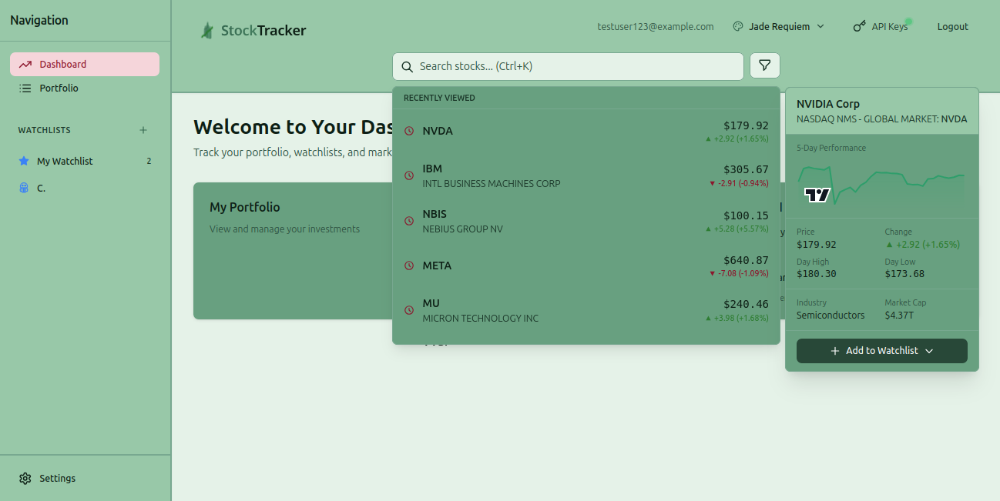

# StockTracker


A real-time stock tracking and portfolio management application with interactive charts, watchlists, and multi-theme support.

<p align="center">
  
  <br>
  <em>Dashboard with recently viewed stocks, instant preview panel, and the Jade Requiem theme</em>
</p>

## Why StockTracker?

### Zero API Costs with Smart Key Rotation

Most stock apps hit API rate limits within minutes. **StockTracker solves this** with an enterprise-grade API management system designed for free-tier sustainability:

| Challenge | StockTracker Solution |
|-----------|----------------------|
| Rate limits kill free tiers | **Intelligent key rotation** - automatically cycles through multiple API keys |
| API calls are wasted | **Smart caching** - reduces redundant calls by 90%+ |
| One provider goes down | **Multi-provider fallback** - Finnhub → Alpha Vantage → Yahoo Finance |
| No visibility into usage | **Real-time rate limit tracking** - SSE notifications before you hit limits |

### Built for Developers

- **Bring Your Own Keys** - Users can add their own API keys, spreading load across the community
- **Graceful Degradation** - App remains functional even when rate-limited (cached data, reduced refresh)
- **Usage Dashboard** - See exactly how many API calls remain per provider
- **Production Patterns** - Learn real-world API management, caching, and rate limiting strategies

### Modern Full-Stack Architecture

```
┌─────────────────────────────────────────────────────────────┐
│  React 18 + Zustand + TailwindCSS + Lightweight Charts      │
├─────────────────────────────────────────────────────────────┤
│  Express API + SQLite (WAL) + SSE Real-time Streaming       │
├─────────────────────────────────────────────────────────────┤
│  API Key Rotation │ Multi-Provider │ Smart Cache │ Fallback │
└─────────────────────────────────────────────────────────────┘
```

## Features

- **Real-time Quotes** - Live price updates via Server-Sent Events (SSE)
- **Interactive Charts** - Candlestick/line charts with technical indicators (SMA, EMA, RSI, MACD)
- **Watchlist Management** - Custom icons, colors, drag-and-drop ordering
- **Multi-theme Support** - Jade Requiem, Terminal Green, and more
- **Search Preview** - Live quote preview on hover with keyboard navigation
- **API Key Management** - User-managed API keys with rate limit tracking

## Tech Stack

| Frontend | Backend | Data |
|----------|---------|------|
| React 18 | Node.js + Express | Finnhub API |
| Zustand | SQLite (WAL mode) | Alpha Vantage |
| TailwindCSS | express-session | Yahoo Finance |
| Lightweight Charts | bcrypt | SSE streaming |

## Quick Start

### 1. Clone and Install

```bash
git clone <repository-url>
cd autonomous_demo_project
./init.sh
```

### 2. Configure API Keys

```bash
cp .env.example .env
```

Edit `.env` and add your API keys:

| Variable | Required | Get Key |
|----------|----------|---------|
| `FINNHUB_API_KEY` | Yes | [finnhub.io/register](https://finnhub.io/register) → Dashboard → API Key |
| `ALPHAVANTAGE_API_KEY` | Yes | [alphavantage.co](https://www.alphavantage.co/support/#api-key) → Get Free API Key |

**Getting your keys:**

1. **Finnhub** (for real-time quotes, search, news)
   - Go to [finnhub.io/register](https://finnhub.io/register)
   - Create free account
   - Copy API key from Dashboard
   - Free tier: 60 API calls/minute

2. **Alpha Vantage** (for chart historical data)
   - Go to [alphavantage.co/support/#api-key](https://www.alphavantage.co/support/#api-key)
   - Enter email, get key instantly
   - Free tier: 25 calls/day

Your `.env` should look like:
```bash
FINNHUB_API_KEY=abc123your_finnhub_key_here
ALPHAVANTAGE_API_KEY=xyz789your_alphavantage_key_here
SESSION_SECRET=any-random-string-for-sessions
```

> **Note:** Without API keys, the app runs in demo mode with limited functionality.

### 3. Start Development

```bash
./start-dev.sh
```

**Access:**
- Frontend: http://localhost:5173
- Backend API: http://localhost:3001

## Project Structure

```
├── backend/
│   ├── src/
│   │   ├── routes/      # API endpoints
│   │   ├── services/    # Market data, API key management
│   │   └── database.js  # SQLite schema
│   └── package.json
├── frontend/
│   ├── src/
│   │   ├── components/  # React components
│   │   ├── pages/       # Route pages
│   │   ├── stores/      # Zustand stores
│   │   ├── themes/      # Theme definitions
│   │   └── contexts/    # React contexts
│   └── package.json
├── init.sh              # Setup script
└── start-dev.sh         # Dev server launcher
```

## License

MIT License

Copyright (c) 2024

Permission is hereby granted, free of charge, to any person obtaining a copy
of this software and associated documentation files (the "Software"), to deal
in the Software without restriction, including without limitation the rights
to use, copy, modify, merge, publish, distribute, sublicense, and/or sell
copies of the Software, and to permit persons to whom the Software is
furnished to do so, subject to the following conditions:

The above copyright notice and this permission notice shall be included in all
copies or substantial portions of the Software.

THE SOFTWARE IS PROVIDED "AS IS", WITHOUT WARRANTY OF ANY KIND, EXPRESS OR
IMPLIED, INCLUDING BUT NOT LIMITED TO THE WARRANTIES OF MERCHANTABILITY,
FITNESS FOR A PARTICULAR PURPOSE AND NONINFRINGEMENT. IN NO EVENT SHALL THE
AUTHORS OR COPYRIGHT HOLDERS BE LIABLE FOR ANY CLAIM, DAMAGES OR OTHER
LIABILITY, WHETHER IN AN ACTION OF CONTRACT, TORT OR OTHERWISE, ARISING FROM,
OUT OF OR IN CONNECTION WITH THE SOFTWARE OR THE USE OR OTHER DEALINGS IN THE
SOFTWARE.

---

Built with [Claude Code](https://claude.com/claude-code)
